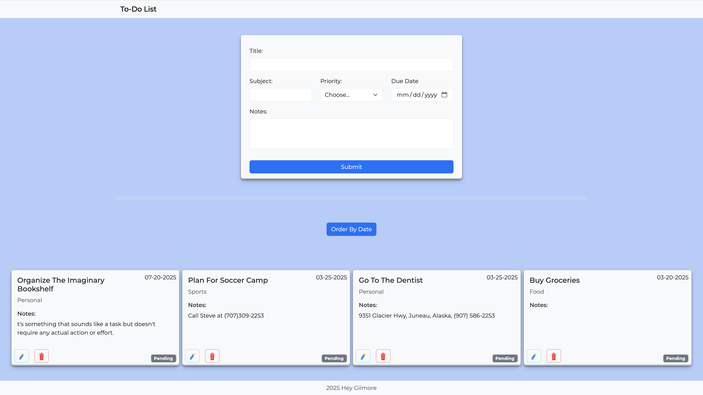

# To-Do List



## 🛠️ Tech Stack

- JavaScript (ES6+)
- HTML5
- CSS3 (with Bootstrap 5)
- Webpack
  - `webpack`, `webpack-cli`, `webpack-dev-server`
  - `html-webpack-plugin`
  - `style-loader`, `css-loader`
  - `bootstrap`, `@popperjs/core`

---

## 📦 Installation & Setup

1. **Clone the repo:**
   ```bash
   git clone https://github.com/heyGilmore/todo-list.git
   cd todo-list
   ```
2. **Install dependencies:**
   ```bash
   npm install
   ```
3. **Run the app locally:**

   ```bash
   npx webpack serve
   # Open http://localhost:8080/
   ```

4. **Build for production:**
   ```bash
   npx run build
   ```

---

## Project Todo List

### Setup

- [x] Create "ToDo List" folder
- [x] Installed Webpack and required loaders:
  - webpack, webpack-cli
  - html-webpack-plugin
  - style-loader, css-loader
  - webpack-dev-server
- [x] Create Basic project structure:
  - index.html
  - src/js/script.js
  - src/css/stylesheet.css
- [x] Configure webpack.config.js
- [x] Add stylesheet.css to script.js
- [x] Initialize with Github
- [x] Set up basic HTML boilerplate
- [x] Run Webpack build successfully
  - npx webpack
  - npx webpack serve
  - http://localhost:8080/
- [x] Add Bootstrap
  - npm i bootstrap@5.3.5
- [x] Import Bootstrap to JS
  - import "bootstrap/dist/css/bootstrap.min.css";
  - import "bootstrap";
- [x] Add Popper Bootstrap
  - npm install @popperjs/core

### HTML & CSS

- [x] Create a Navigation Bar
- [x] Create a Footer
- [x] Create a div for content

### Javascript

- [x] Add Form in div#content with inputs
  - Task Name
  - Date to be completed
  - Subject
  - Priority
  - Category
- [x] Create a JSON data with pre-made data
  - Pre-made tasks so when the pages loads
- [x] Show case pre-made data
- [x] Enable form submissions to add tasks to the task list.
- [x] Created a Delete unction
  - Remove tasks from the UI and the data array
- [x] Edit button clicked, prefill form to edit
- [x] Created toggle button for completed or pending
  - Card background changes due to status
- [x] Added Sorting functionality
  - Order by date button is clicked.


## 📚 Learnings

Through this project, I improved my understanding of:

   -  Using Webpack setup and optimization for modern JavaScript projects.

   -  Using modular coding practices in JavaScript.

   -  Using Bootstrap 5 to create responsive designs.

   - Pre-fill the form with data saved from the JSON data. 